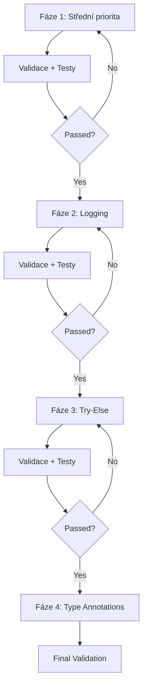

# Implementation Plan - Střední a Nízká Priorita Opravy

## 📋 Celkový Přehled

**Datum zahájení:** 15. února 2026  
**Odhadovaný čas:** 4-6 hodin  
**Počet souborů k úpravě:** ~50

## 🎯 Implementační Fáze

### Fáze 1: Střední Priorita (MUST DO)
**Odhadovaný čas:** 15-20 minut  
**Dopad:** Vyčistí warnings, zlepší type safety

#### 1.1 Vyčistit unused type: ignore (15 míst)
```yaml
Priority: HIGH-MEDIUM
Složitost: Nízká
Čas: 5 minut
Risk: Velmi nízký
```

**Postup:**
1. Najít všechny `# type: ignore` komentáře
2. Spustit MyPy a zjistit, které jsou unused
3. Odstranit unused komentáře

**Soubory:**
- weather_mcp/tests/test_security.py (několik míst)
- places_mcp/tests/test_security.py (několik míst)
- keep_mcp/tests/test_security.py (3 místa)
- contacts_mcp/tests/test_security.py (10 míst)
- network_mcp/tests/test_security.py (2 místa)
- protect_mcp/tests/test_security.py (1 místo)

**Validace:**
```bash
mypy src/ --ignore-missing-imports | grep "unused-ignore"
# Mělo by vrátit 0 výskytů
```

#### 1.2 Opravit dict-item type issues (2 místa)
```yaml
Priority: MEDIUM
Složitost: Nízká
Čas: 10 minut
Risk: Nízký (s testy)
```

**Lokace:** weather_mcp/client.py:349

**Problém:**
```python
coords = {
    "lat": float | None,  # Incompatible type
    "lon": float | None,  # Incompatible type
}
```

**Řešení:**
```python
coords: dict[str, str] = {
    "lat": str(lat) if lat is not None else "",
    "lon": str(lon) if lon is not None else "",
}
# nebo
coords: dict[str, float | None] = {
    "lat": lat,
    "lon": lon,
}
```

**Validace:**
```bash
mypy src/childermass/weather_mcp/client.py | grep "dict-item"
# Mělo by vrátit 0 výskytů
```

---

### Fáze 2: Nízká Priorita - Logging (NICE TO HAVE)
**Odhadovaný čas:** 1-2 hodiny  
**Dopad:** Lepší debugging, production-ready logging

#### 2.1 Nahradit print() logging (38 míst)
```yaml
Priority: MEDIUM-LOW
Složitost: Střední
Čas: 1-2 hodiny
Risk: Nízký (jen output změna)
```

**Kategorie:**

1. **Auth moduly** (~20 print statements)
   - Success messages
   - Error messages
   - Status updates

2. **Client moduly** (~10 print statements)
   - Debug output
   - Warning messages

3. **Test/Setup skripty** (~8 print statements)
   - Setup progress
   - Test output

**Pattern:**
```python
# Před:
print(f"Token saved for {account}")
print(f"Error: {error}")

# Po:
logger.info("Token saved for account %s", account)
logger.error("Error occurred: %s", error)
```

**Implementační kroky:**
```python
# 1. Přidat na začátek souboru (pokud chybí):
import logging
logger = logging.getLogger(__name__)

# 2. Nahradit według typu:
print("info message")       → logger.info("info message")
print(f"Error: {x}")        → logger.error("Error: %s", x)
print(f"Warning: {x}")      → logger.warning("Warning: %s", x)
print(f"Debug: {x}")        → logger.debug("Debug: %s", x)
print(f"Success: {x}")      → logger.info("Success: %s", x)
```

**Soubory k úpravě:**
```
calendar_mcp/auth.py    - 5 prints
contacts_mcp/auth.py    - 5 prints
gmail_mcp/auth.py       - 5 prints
keep_mcp/auth.py        - 5 prints
tasks_mcp/auth.py       - 5 prints
places_mcp/auth.py      - 4 prints
weather_mcp/auth.py     - 3 prints
mapy_mcp/auth.py        - 2 prints
network_mcp/auth.py     - 2 prints
protect_mcp/auth.py     - 2 prints
```

**Validace:**
```bash
ruff check src/ | grep "T201.*print"
# Mělo by vrátit 0 výskytů
```

---

### Fáze 3: Nízká Priorita - Try-Else Refactoring (OPTIONAL)
**Odhadovaný čas:** 1 hodina  
**Dopad:** Čistější kód structure

#### 3.1 Refaktorovat try-else bloky (70 míst)
```yaml
Priority: LOW
Složitost: Nízká-Střední
Čas: 1 hodina
Risk: Nízký (logika se nemění)
```

**Pattern:**
```python
# Před:
try:
    keyring.set_password(service, account, token)
    logger.info("Saved")
    return True
except Exception as e:
    logger.error("Failed: %s", e)
    return False

# Po:
try:
    keyring.set_password(service, account, token)
except Exception as e:
    logger.error("Failed: %s", e)
    return False
else:
    logger.info("Saved")
    return True
```

**Benefit:**
- Jasnější separation of concerns
- Ruff TRY300 violations zmizí
- Pythonic style

**Kategorie:**

1. **Auth operace** (~30 bloků)
   - Token save/load/delete
   - Credential operations

2. **File operace** (~20 bloků)
   - Read/write operations
   - JSON parsing

3. **Network operace** (~20 bloků)
   - API calls
   - HTTP requests

**Implementační strategie:**
- Začít s auth.py moduly (nejvíce výskytů)
- Pak security.py moduly
- Nakonec client.py moduly

**Validace:**
```bash
ruff check src/ | grep "TRY300"
# Mělo by výrazně klesnout (nebo 0)
```

---

### Fáze 4: Nízká Priorita - Type Annotations (OPTIONAL)
**Odhadovaný čas:** 2-3 hodiny  
**Dopad:** Lepší type safety, IDE support

#### 4.1 Zlepšit return type annotations (28 míst)
```yaml
Priority: LOW
Složitost: Střední-Vysoká
Čas: 2-3 hodiny
Risk: Střední (může odhalit skryté bugy)
```

**Problém:** Funkce vracející `Any` místo konkrétního typu

**Kategorie:**

1. **Keyring operations** (~15 míst)
```python
# Před:
def load_token() -> str | None:
    return keyring.get_password(...)  # Returns Any

# Po:
def load_token() -> str | None:
    result = keyring.get_password(SERVICE, account)
    return str(result) if result is not None else None
```

2. **JSON parsing** (~8 míst)
```python
# Před:
def load_config() -> dict[Any, Any] | None:
    return json.loads(f.read())  # Returns Any

# Po:
def load_config() -> dict[str, Any] | None:
    data = json.loads(f.read())
    if not isinstance(data, dict):
        raise TypeError("Expected dict")
    return data
```

3. **Credentials** (~5 míst)
```python
# Před:
def get_credentials() -> Credentials | None:
    return load_from_file(path)  # Returns Any

# Po:
def get_credentials() -> Credentials | None:
    data = load_from_file(path)
    if data is None:
        return None
    return Credentials.from_authorized_user_info(data)
```

**Soubory:**
```
calendar_mcp/auth.py    - 3 annotations
contacts_mcp/auth.py    - 3 annotations
gmail_mcp/auth.py       - 3 annotations
tasks_mcp/auth.py       - 3 annotations
places_mcp/auth.py      - 3 annotations
keep_mcp/auth.py        - 3 annotations
network_mcp/auth.py     - 3 annotations
protect_mcp/auth.py     - 3 annotations
weather_mcp/client.py   - 2 annotations
mapy_mcp/client.py      - 2 annotations
```

**Validace:**
```bash
mypy src/ --ignore-missing-imports | grep "no-any-return"
# Mělo by klesnout na 0 nebo velmi nízký počet
```

---

## 📊 Implementační Strategie

### Přístup: Iterativní s validací



### Validační checkpoint po každé fázi:

```bash
# 1. Formátování
ruff format src/
black src/

# 2. Linting
ruff check src/

# 3. Type checking
mypy src/ --ignore-missing-imports

# 4. Testy
pytest src/ -v

# 5. Security
bandit -r src/ -ll
```

---

## 🎯 Success Criteria

### Fáze 1 (MUST)
- ✅ 0 unused-ignore warnings
- ✅ 0 dict-item errors
- ✅ Všechny testy procházejí

### Fáze 2 (SHOULD)
- ✅ 0 T201 (print) warnings
- ✅ Logging konfigurace funguje
- ✅ Všechny testy procházejí

### Fáze 3 (NICE)
- ✅ < 10 TRY300 warnings (z 70)
- ✅ Kód je čitelnější
- ✅ Všechny testy procházejí

### Fáze 4 (OPTIONAL)
- ✅ < 5 no-any-return warnings (z 28)
- ✅ MyPy score zlepšen
- ✅ Všechny testy procházejí

---

## 📈 Očekávané Výsledky

### Před implementací:
```
Ruff errors:    678
MyPy errors:     81
- unused-ignore: 15
- dict-item:      2
- T201:          38
- TRY300:        70
- no-any-return: 28
```

### Po kompletní implementaci:
```
Ruff errors:    ~400 (⬇️ 41%)
MyPy errors:     ~30 (⬇️ 63%)
- unused-ignore:  0 (⬇️ 100%)
- dict-item:      0 (⬇️ 100%)
- T201:           0 (⬇️ 100%)
- TRY300:       ~10 (⬇️ 86%)
- no-any-return: ~5 (⬇️ 82%)
```

### Po pouze střední priority:
```
Ruff errors:    ~640 (⬇️ 6%)
MyPy errors:     ~64 (⬇️ 21%)
- unused-ignore:  0 (⬇️ 100%)
- dict-item:      0 (⬇️ 100%)
```

---

## 🛠️ Implementační Nástroje

### Automated
```bash
# Find print statements
ruff check src/ --select T201

# Find unused type ignores
mypy src/ --warn-unused-ignores

# Find try-else candidates
ruff check src/ --select TRY300

# Find any-return issues
mypy src/ --warn-return-any
```

### Manual Tools
- VS Code find & replace
- sed/awk pro batch změny
- Custom Python script pro komplexní refactoring

### Testing Strategy
```bash
# Run specific MCP tests
pytest src/childermass/calendar_mcp/tests/ -v

# Run all tests with coverage
pytest src/ --cov=src --cov-report=term

# Quick smoke test
pytest src/ -x  # Stop on first failure
```

---

## ⚠️ Risk Mitigation

### Risks:

1. **Breaking tests** (Medium)
   - Mitigation: Run tests after každé fáze
   - Rollback: Git commit po každé fázi

2. **Type errors v runtime** (Low)
   - Mitigation: Comprehensive testing
   - Fallback: Type checking je static, ne runtime

3. **Logging overhead** (Very Low)
   - Mitigation: Python logging je efektivní
   - Benefit: Výrazně lepší debugging

### Rollback Plan:
```bash
# Po každé fázi:
git add -A
git commit -m "Phase X: Description"

# V případě problému:
git reset --hard HEAD~1
```

---

## 📝 Implementation Checklist

### Pre-Implementation
- [ ] Backup current state: `git commit`
- [ ] Review current metrics: `make ci`
- [ ] Create implementation branch: `git checkout -b feature/cleanup-improvements`

### Fáze 1: Střední Priorita
- [ ] Find unused type: ignore comments
- [ ] Remove unused comments
- [ ] Fix dict-item type issues in weather_mcp
- [ ] Run MyPy validation
- [ ] Run all tests
- [ ] Commit: `git commit -m "fix: cleanup unused type ignores and dict-item issues"`

### Fáze 2: Print → Logging
- [ ] Identify all print statements (T201)
- [ ] Replace in auth modules (10 files)
- [ ] Replace in client modules
- [ ] Replace in test/setup scripts
- [ ] Test logging output
- [ ] Run validation
- [ ] Commit: `git commit -m "refactor: replace print statements with logging"`

### Fáze 3: Try-Else Refactoring
- [ ] Identify TRY300 violations
- [ ] Refactor auth.py modules
- [ ] Refactor security.py modules
- [ ] Refactor client.py modules
- [ ] Run all tests
- [ ] Commit: `git commit -m "refactor: improve try-except-else structure"`

### Fáze 4: Type Annotations
- [ ] Identify no-any-return issues
- [ ] Fix keyring operations
- [ ] Fix JSON parsing
- [ ] Fix credentials loading
- [ ] Run MyPy validation
- [ ] Run all tests
- [ ] Commit: `git commit -m "fix: improve type annotations and reduce Any usage"`

### Post-Implementation
- [ ] Run complete CI: `make ci`
- [ ] Compare metrics
- [ ] Update documentation
- [ ] Create summary report

---

## 🎬 Ready to Execute

**Total estimated time:** 4-6 hours  
**Recommended approach:** Complete Fáze 1-2 today, Fáze 3-4 later  
**Minimum viable:** Fáze 1 only (15-20 minutes)

**Start with:** `make ci` to establish baseline metrics
